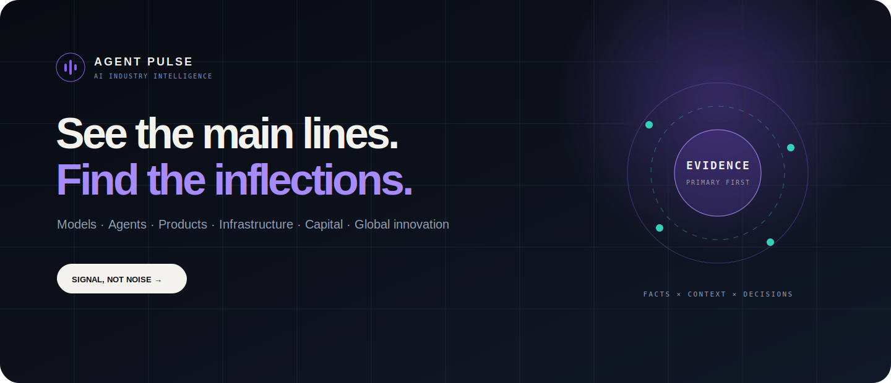

<p align="right">
  <strong>English</strong> · <a href="README-zh-cn.md">简体中文</a>
</p>

<p align="center">
  
</p>

<h1 align="center">Agent Pulse</h1>

> **Evidence-backed AI industry intelligence for people who need to decide, not just keep up.** Agent Pulse turns official releases, research papers, capital moves, policy changes, and public propagation signals into traceable Events, evolving industry judgments, and explicit next signals.

<p align="center">
  <a href="https://barretlee.github.io/agent-pulse/"><strong>Open Agent Pulse</strong></a>
  · <a href="https://github.com/barretlee/agent-pulse"><strong>⭐ Star this repository</strong></a>
  · <a href="README-zh-cn.md"><strong>Read in Chinese</strong></a>
</p>

<p align="center">
  <a href="https://github.com/barretlee/agent-pulse/actions/workflows/ci.yml"></a>
  <a href="https://github.com/barretlee/agent-pulse/actions/workflows/data-refresh.yml"></a>
  <a href="https://github.com/barretlee/agent-pulse/actions/workflows/source-audit.yml"></a>
  <a href="https://github.com/barretlee/agent-pulse/releases/latest"></a>
  <a href="https://github.com/barretlee/agent-pulse"></a>
  <a href="LICENSE"></a>
</p>

## From signal to decision

AI has no shortage of news, feeds, or hot takes. What is scarce is a reliable way for investors, executives, founders, business leaders, and technical leaders to answer three questions:

1. **What materially changed?** Not every announcement deserves a new view.
2. **Why does it matter?** A fact becomes useful only when connected to an industry shift and the people it affects.
3. **What would change the judgment?** Every durable view needs a next signal, counter-signal, or invalidation condition.

Agent Pulse is built around that loop: observe broadly, publish selectively, preserve the evidence trail, and update a judgment only when the evidence changes.

If that is the kind of public intelligence infrastructure you want to exist, [star Agent Pulse](https://github.com/barretlee/agent-pulse). It helps more decision-makers and builders discover the project and is the clearest signal that the open version is worth maintaining.

## Explore the product

| Product surface | The question it answers | Current boundary |
| --- | --- | --- |
| [**Latest material shift**](https://barretlee.github.io/agent-pulse/) | What changed enough to revisit the current view? | Public judgments are evidence-linked; updates are event-driven, not quota-driven. |
| [**Six strategic views**](https://barretlee.github.io/agent-pulse/lines/) | Is this an isolated announcement or part of a longer capability, product, infrastructure, capital, or geographic shift? | Narratives share the same Event evidence instead of duplicating facts. |
| [**Evidence timeline**](https://barretlee.github.io/agent-pulse/timeline/) | What happened first, what changed later, and which primary sources support it? | Every published Event links back to public evidence. |
| [**Source activity**](https://barretlee.github.io/agent-pulse/signals/) | What are catalogued sources publishing before signals converge into Events? | This is an allowlisted observation layer, not verified fact publication. |
| [**Coverage and sources**](https://barretlee.github.io/agent-pulse/sources/) | Where is coverage strong, weak, active, isolated, or restricted? | Catalog presence is kept separate from effective observation and production qualification. |
| [**Scout**](https://barretlee.github.io/agent-pulse/scout/) | What product, research, content, or internal experiment may be worth validating? | Scout is experimental and produces evidence-linked hypotheses, not facts or investment conclusions. |

[Start with the latest material shift →](https://barretlee.github.io/agent-pulse/)

## Not another news aggregator

Every public event is designed to separate six layers:

1. **Fact** — what happened and when;
2. **Evidence** — the original release, paper, filing, or policy document;
3. **Context** — what came before and what actually changed;
4. **Impact** — who is affected across technology, business, capital, and policy;
5. **Judgment** — the current interpretation, with uncertainty made explicit;
6. **Next signal** — what would strengthen, weaken, or invalidate the judgment.

```text
official releases + papers + filings + expert and propagation signals
                                │
                                ▼
       collect → normalize → deduplicate → cluster → evidence binding
                                │
                                ▼
     deterministic gate → strategic narrative → next signal → public event
```

Aggregators can suggest candidates or propagation heat, but cannot become the sole factual evidence for a material event. External text is never treated as trusted HTML, and private operational data never enters the public static export.

## Live, auditable, and honest about its limits

The repository is not a mockup. It contains the source catalog, collectors, evidence model, automatic quality gates, static renderer, source-health automation, and GitHub Pages delivery path used by the live product. It also keeps four states deliberately separate: **catalogued**, **observed**, **active**, and **published**.

GitHub Actions refreshes public data and redeploys the static site once per day. The source audit, monitor, and quality guard remain weekly; the `weekly-brief` Issue is created or updated only on Sunday (or by an explicit manual run) and only when at least one public Event clears the weekly gate, so daily freshness does not create empty Issues.

Repository evidence checked on **2026-07-14**. Source-health numbers below come from the full audit completed at **2026-07-14 05:36 UTC**; content counts come from the versioned repository snapshot.

| Measure | Verified state |
| --- | ---: |
| Sources in the current catalog | 414 |
| Sources covered by that full audit | 414 |
| Healthy / degraded / failed / skipped | 266 / 27 / 70 / 51 |
| Accessible endpoints / endpoints with content | 398 / 276 |
| Active production sources | 5 |
| Published evidence-backed events | 331 |
| Normalized Signals in the repository snapshot | 4,940 |

See the machine-generated [source health report](data/reports/source-health.json), [data-source policy](docs/SOURCES.md), and [capability map](docs/CAPABILITIES.md).

The public source-update stream exposes only allowlisted titles, attribution, dates, categories, tags, and canonical links. It remains an observation layer and cannot bypass the evidence and readiness gates required for Event publication. The limitations are equally important: production qualification still needs a real observation window; many historical events need more independent evidence; claim-level evidence, multilingual semantic clustering, real MySQL integration coverage, and user outcome feedback are still incomplete. Planned or experimental capabilities are never presented as shipped.

## Architecture

```text
sources and discovery signals
          │
   SourceAdapter boundary
          │
safe fetch → normalize → quality gate → deduplicate
          │
isolated observation / event clustering
          │
evidence binding → deterministic readiness gate
          │
     ┌────┴────┐
     ▼         ▼
Control Room   privacy-safe static site → GitHub Pages
```

SQLite is the zero-configuration default. A MySQL dialect path exists, but the project does not claim MySQL compatibility without real integration coverage. Public Pages contain only allowlisted DTOs; databases, credentials, raw payloads, proxy settings, and private notes are excluded.

Read the [architecture](docs/ARCHITECTURE.md), [roadmap](docs/ROADMAP.md), or [changelog](CHANGELOG.md) for implementation details and release history.

## Run locally

Requires Node.js 22 or later.

```bash
git clone https://github.com/barretlee/agent-pulse.git
cd agent-pulse
npm install
cp .env.example .env
npm run dev
```

Local startup automatically migrates the database, refreshes catalog seed metadata, and merges the latest versioned repository snapshot. A fresh clone and an existing local SQLite database therefore start from the same complete repository dataset without deleting newer local evidence. `npm run db:seed` and the default `npm run export` use the same bootstrap path.

Open:

- Public site: <http://127.0.0.1:8899/>
- Private Control Room: <http://127.0.0.1:8899/admin/>
- Health endpoint: <http://127.0.0.1:8899/api/health>

Useful commands:

```bash
npm run collect               # Collect, deduplicate, cluster, and score
npm run ai:enrich             # Enrich eligible review Events when explicitly enabled
npm run sources:audit         # Run a non-destructive full source audit
npm run weekly:issue          # Render the current public weekly brief
npm run ops:reconcile         # Reconcile source health and discovery state
npm run scout:generate -- 5   # Publish or archive evidence-linked Scout opportunities
npm run export                # Generate the static site in dist/
npm run check                 # Lint, typecheck, tests, and static export
```

Local development can run without `ADMIN_TOKEN`. Any non-development deployment must use a strong token and keep the Control Room behind private access controls.

AI-assisted Event convergence and weekly-brief drafting remain **experimental and opt-in for local runs**. Put `DEEPSEEK_API_KEY` only in the ignored local `.env` or a GitHub Actions Secret, set `AI_ENRICHMENT_ENABLED=true`, and keep `.env.example` free of real credentials. The model only receives cropped normalized Evidence or public static DTOs; schema, evidence, readiness, and publication gates remain deterministic.

## Contribute

High-leverage contributions include stable source adapters, parser fixtures, paper and benchmark coverage, evidence-quality improvements, failure-isolation tests, and clearer product explanations.

- Code changes: [CONTRIBUTING.md](CONTRIBUTING.md)
- Source proposals and corrections: [Contributing Sources](docs/CONTRIBUTING_SOURCES.md)
- Community rules: [Code of Conduct](CODE_OF_CONDUCT.md)
- Private security reports: [SECURITY.md](SECURITY.md)

If Agent Pulse helps you replace information overload with clearer judgment, [⭐ star the repository](https://github.com/barretlee/agent-pulse) and share the one-sentence description at the top.

## License and responsible use

The [MIT License](LICENSE) applies to Agent Pulse source code and original repository documentation unless a file states otherwise. It does not grant rights to third-party articles, papers, release notes, trademarks, images, feeds, or other source material. Public intelligence output contains limited metadata, attribution, canonical links, and Agent Pulse's original synthesis.

Read [Copyright, Sources, and Responsible Use](docs/LEGAL.md) and [Third-Party Notices](THIRD_PARTY_NOTICES.md). Agent Pulse provides research and decision-support information, not investment, legal, procurement, or other professional advice.

[MIT](LICENSE) © 2026 Barret Lee
