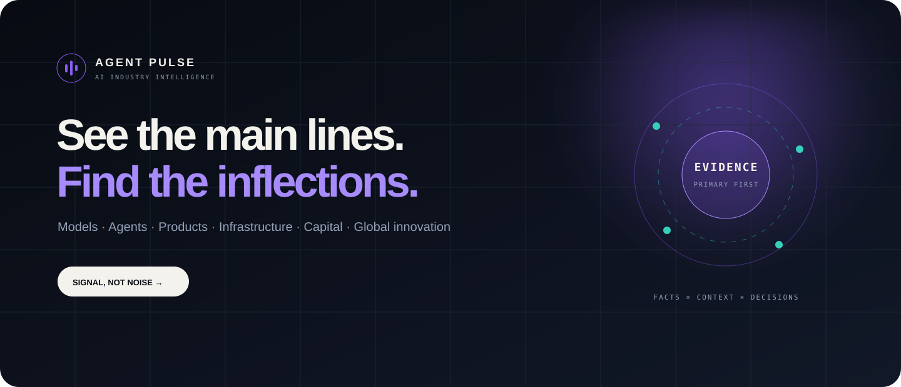

<p align="right">
  <strong>English</strong> · <a href="README-zh-cn.md">简体中文</a>
</p>

<p align="center">
  
</p>

<h1 align="center">Agent Pulse</h1>

> **Evidence-backed intelligence for the embodied-data production pipeline.** Agent Pulse connects collection, governance, annotation, simulation, evaluation, and delivery evidence so decision-makers can see what changed, why it matters, and what to verify next.

<p align="center">
  <a href="https://susuyan.github.io/eai-pulse/"><strong>Open the live product</strong></a>
  · <a href="https://github.com/susuyan/eai-pulse"><strong>View the repository</strong></a>
  · <a href="README-zh-cn.md"><strong>简体中文</strong></a>
</p>

<p align="center">
  <a href="https://github.com/susuyan/eai-pulse/actions/workflows/ci.yml"></a>
  <a href="https://github.com/susuyan/eai-pulse/actions/workflows/data-refresh.yml"></a>
  <a href="https://github.com/susuyan/eai-pulse/actions/workflows/source-audit.yml"></a>
  <a href="LICENSE"></a>
</p>

## What the product covers

The public product is organized around six decision views. They share one evidence graph and do not copy facts into parallel narratives.

| View | Decision question | Public boundary |
| --- | --- | --- |
| [**Key changes**](https://susuyan.github.io/eai-pulse/) | Which production constraint or capability changed? | 36 published Events link to public evidence. |
| [**Pipeline**](https://susuyan.github.io/eai-pulse/pipeline/) | Where does the change affect collection, governance, annotation, simulation, evaluation, or delivery? | Six ordered stages; no stage is inferred from popularity alone. |
| [**Assets**](https://susuyan.github.io/eai-pulse/assets/) | Which datasets, standards, and collection methods are reusable? | 12 datasets, 4 standards, and 6 collection methods with explicit evidence. |
| [**Peers**](https://susuyan.github.io/eai-pulse/peers/) | What do companies and institutions publicly claim they can do? | 15 evidence-linked capability profiles; a claim is not treated as measured performance. |
| [**Sources**](https://susuyan.github.io/eai-pulse/sources/) | Which sources are catalogued and what is their lifecycle state? | Catalog presence is separate from effective observation and production qualification. |
| [**Scout**](https://susuyan.github.io/eai-pulse/scout/) | Which product, research, or content experiment is worth testing next? | Evidence-linked hypotheses, never automatic facts or investment conclusions. |

The [timeline](https://susuyan.github.io/eai-pulse/timeline/) preserves chronology, and each Event has a stable detail page with its source links. English pages, structured JSON, Sitemap, RSS, and `llms.txt` use the same public contract.

## Production model

```text
public primary evidence
          │
          ▼
discover → collect → normalize → validate relevance
          │
          ▼
deduplicate → bind evidence → detect conflicts → readiness gate
          │
          ├── blocked/review: persist reason codes and provenance
          │
          └── ready: publish allowlisted static DTOs
```

`Event` is the only fact node. Pipeline stages, actors, audiences, regions, technologies, resources, and opportunities add interpretation without duplicating the fact. Facts, inferences, capability claims, predictions, and opportunity hypotheses remain visibly distinct.

The public exporter is fail-closed. It validates embodied-data relevance, evidence coverage, route contracts, object counts, structured metadata, and the absence of legacy generic-AI framing. Raw payloads, databases, credentials, private notes, local paths, and management-only readiness reasons never enter GitHub Pages.

## Verified public baseline

The versioned snapshot currently provides:

| Object | Count |
| --- | ---: |
| Published Events | 36 |
| Pipeline stages | 6 |
| Datasets | 12 |
| Standards | 4 |
| Collection methods | 6 |
| Peer capability profiles | 15 |
| Public source records | 36 |
| Scout opportunities | 7 |

All 36 embodied-data sources remain in shadow. They are a discovery and observation catalog, not active production collectors. Promotion to `active` requires contract tests, compliance checks, a real observation window, health evidence, and the existing lifecycle gates.

SQLite is the zero-configuration default. A MySQL dialect path exists, but MySQL compatibility is not claimed because real MySQL integration coverage is not complete.

The migration preserves historical provenance in the controlled snapshot. That retained history does not make legacy generic-AI content public: only embodied-data objects that pass the current scope, evidence, and readiness gates enter the allowlisted DTOs.

## Architecture

```text
SourceAdapter catalog and shadow observation
                 │
        safe fetch and normalization
                 │
  relevance, evidence, conflict, and readiness gates
                 │
       ┌─────────┴─────────┐
       ▼                   ▼
private control plane   public DTOs → static renderer → GitHub Pages
```

The static site remains fully usable without a database or server runtime. The private control plane owns source lifecycle, collection state, audit data, and publication decisions.

Read the [architecture](docs/ARCHITECTURE.md), [embodied-data specification](docs/specs/2026-09-19-embodied-data-intelligence/PRD.md), [data-source policy](docs/SOURCES.md), and [changelog](CHANGELOG.md) for the detailed contracts.

## Run locally

Requires Node.js 22 or later.

```bash
git clone https://github.com/susuyan/eai-pulse.git
cd eai-pulse
npm install
cp .env.example .env
npm run dev
```

Open:

- Public site: <http://127.0.0.1:8899/>
- Private Control Room: <http://127.0.0.1:8899/admin/>
- Health endpoint: <http://127.0.0.1:8899/api/health>

Useful checks:

```bash
npm run check
npm run build
npm run export
npm run public:validate
npm run public:fingerprint
```

Local startup migrates the SQLite database, refreshes catalog metadata, and restores the versioned snapshot. Keep secrets only in the ignored local `.env` or GitHub Actions Secrets.

## Contribute

High-value contributions include source adapters with fixtures, schema-drift tests, embodied-data evidence, asset corrections, peer-claim corrections, failure-isolation tests, and public-contract improvements.

- [Contribution guide](CONTRIBUTING.md)
- [Source proposals](docs/CONTRIBUTING_SOURCES.md)
- [Code of Conduct](CODE_OF_CONDUCT.md)
- [Private security reports](SECURITY.md)

## License and responsible use

The [MIT License](LICENSE) applies to project code and original repository documentation unless a file states otherwise. It does not grant rights to third-party articles, papers, standards, trademarks, images, feeds, datasets, or other source material. Public output contains limited metadata, attribution, canonical links, and original synthesis.

Read [Copyright, Sources, and Responsible Use](docs/LEGAL.md) and [Third-Party Notices](THIRD_PARTY_NOTICES.md). Agent Pulse provides research and decision support, not investment, legal, procurement, or other professional advice.
